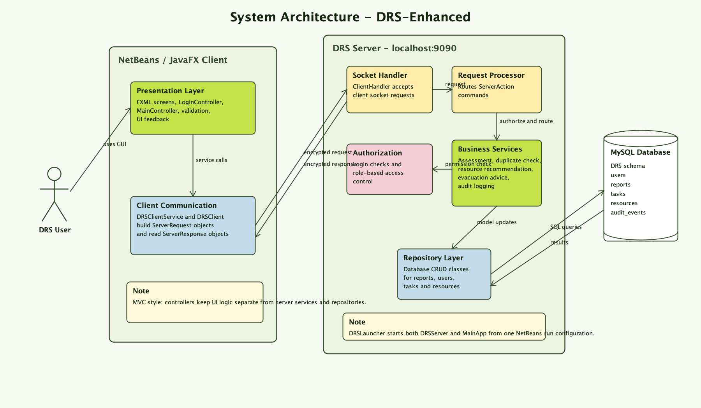
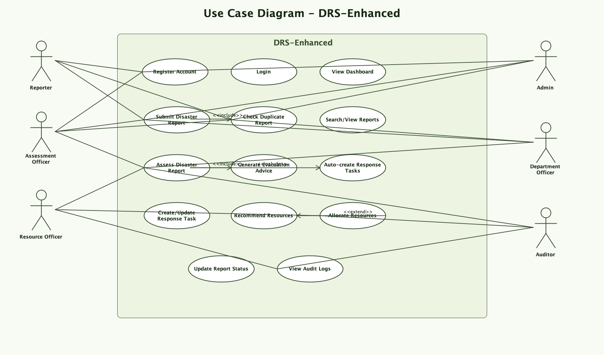
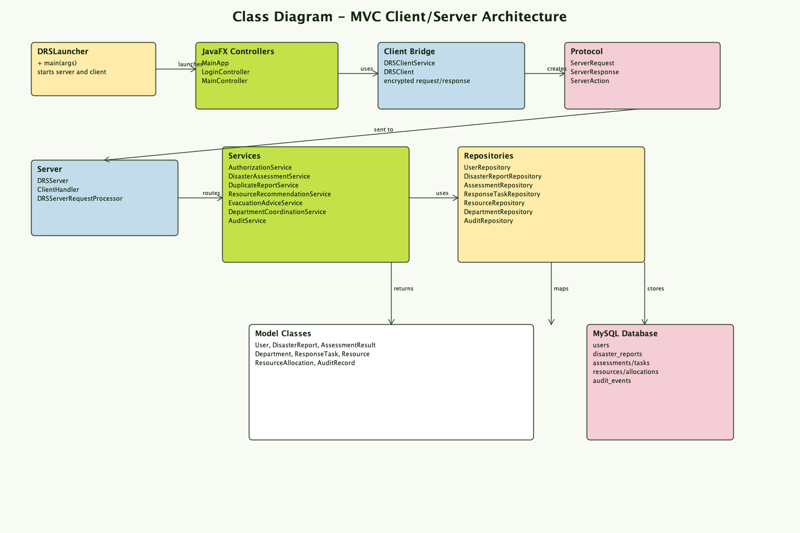
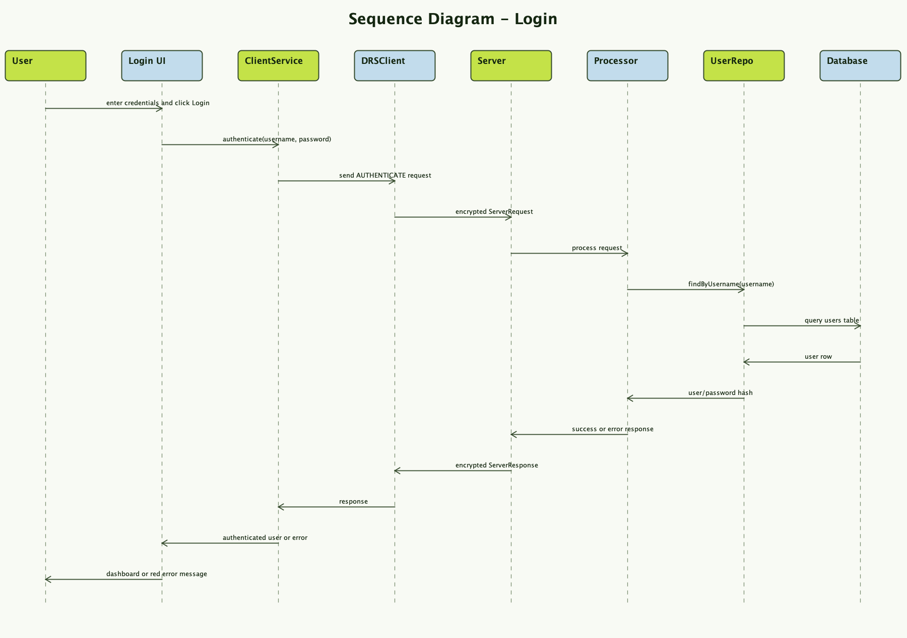
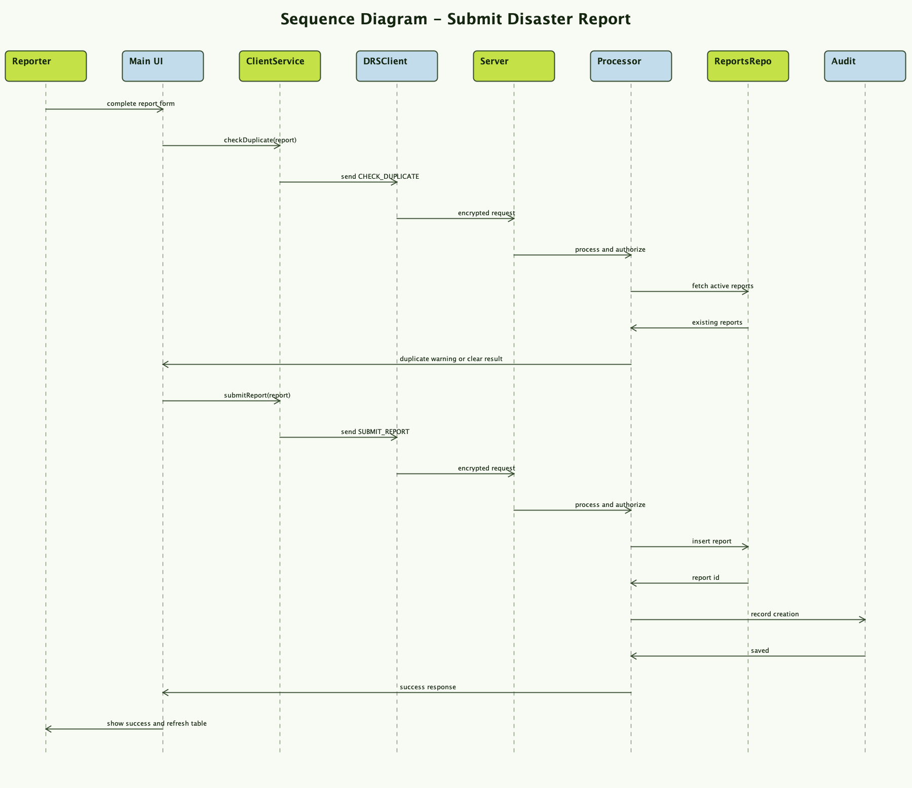
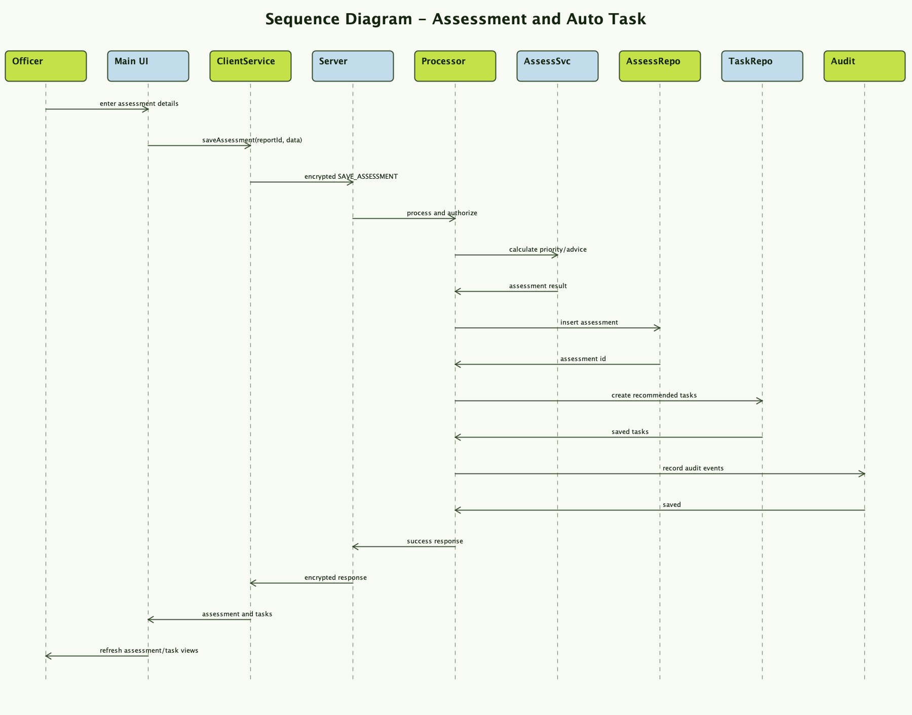
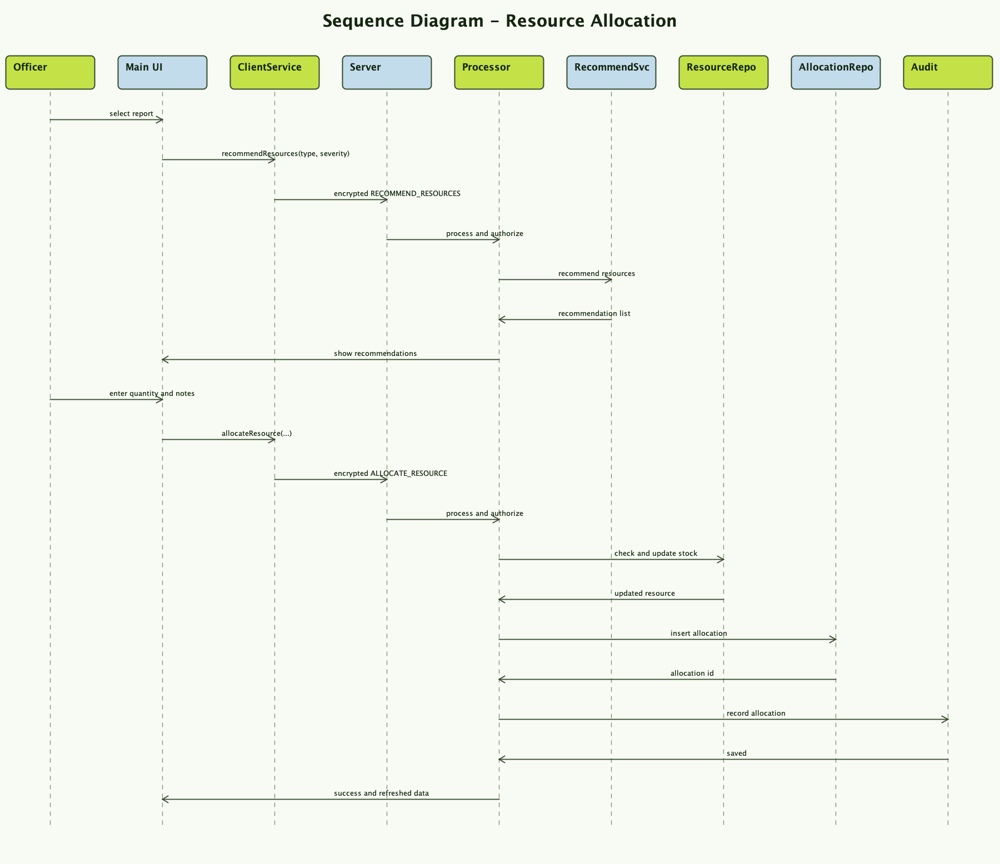
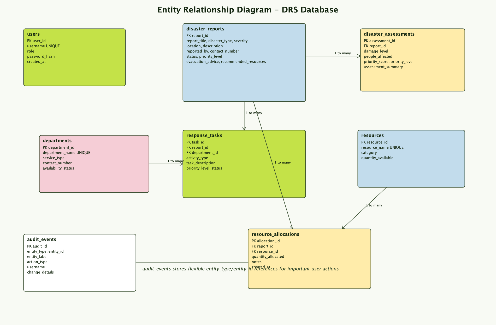

# DRS - Disaster Response System

## Project Overview

DRS is a JavaFX desktop application developed for disaster response prototype that allows users to report disasters, assess disaster severity, generate prioritised responses, coordinate departments, manage response tasks, recommend resources, allocate resources, and track response progress.

The application follows the MVC architecture and uses MySQL for persistent data storage. It includes a client/server design where the JavaFX client uses `DRSClientService` to send requests to a server-side request processor, and the server layer handles business logic and database access.

UI responsibilities are separated from view formatting and control setup using helper classes such as `ComboBoxInitializer`, `TableSetupHelper`, `UiDataRefresher`, and `ViewFormatter`.

It was developed using Visual Studio Code, Maven, JDK 17, JavaFX, and MySQL.

---

## Technologies Used

| Technology | Purpose |
|---|---|
| Java JDK 17 | Main programming language and runtime |
| JavaFX | Desktop GUI development |
| FXML | User interface layout |
| CSS | Custom user interface styling |
| Maven | Dependency management and build tool |
| MySQL | Database storage |
| MySQL Connector/J | Java connection to MySQL |
| JUnit 5 | Unit testing |
| Visual Studio Code | IDE used for development |

---

## Project Structure

The code is organised into logical packages:

- `com.sadman.drs.client` - client-side networking and server communication wrapper
- `com.sadman.drs.controller` - JavaFX UI controller and view helper classes
- `com.sadman.drs.model` - domain objects such as `DisasterReport`, `ResponseTask`, and `Resource`
- `com.sadman.drs.protocol` - shared request/response transport classes for socket communication
- `com.sadman.drs.server` - server-side request processing, services, and repositories that access MySQL

This separation keeps the JavaFX UI layer separate from networking, transport, and backend logic.

## Design Diagrams

The project includes PNG diagram images that can be inserted directly into the group report.

### System Architecture



### Use Case Diagram



### Class Diagram



### Sequence Diagrams









### ERD



## Secure Transport
The client/server communication channel uses AES-based transport protection. Each `ServerRequest` and `ServerResponse` is encrypted as a `SealedObject` before being written to the socket, so disaster data is not sent as plaintext payload objects.

## Example Client → Server → Client Flow

1. `DRSLauncher` starts the DRS socket server on `localhost:9090` and then opens the JavaFX client.
2. The JavaFX controller builds a `DisasterReport` object from the report form.
3. `DRSClientService.submitReport(report)` wraps it in a `ServerRequest` with `ServerAction.SUBMIT_REPORT`.
4. `DRSClient` encrypts the request using `CryptoUtils.seal(...)` and sends the sealed object over the socket connection.
5. `ClientHandler` receives the sealed object, decrypts it, and passes the `ServerRequest` to `DRSServerRequestProcessor.processRequest(...)`.
6. `handleSubmitReport(request.getPayload())` extracts the `DisasterReport` payload and saves it to the database.
7. The server creates `ServerResponse.success("Report submitted", savedReport)`, encrypts it, and sends it back to the client.
8. `DRSClient` decrypts the response and `DRSClientService.submitReport(...)` returns the saved `DisasterReport` back to the controller.
9. The controller updates the UI with the saved report details.

## Main Features

### 1. Disaster Reporting

Users can submit disaster reports with:

- Report title
- Disaster type
- Severity
- Location
- Reporter name
- Contact number
- Description

Supported disaster types include:

- Fire
- Flood
- Earthquake
- Hurricane
- Storm
- Chemical Spill
- Other

Each disaster report is saved into the MySQL database.

---

### 2. Duplicate Disaster Report Detection

Before submitting a report, the user must click **Check Duplicate**.

The system checks whether a similar active disaster report already exists using:

- Disaster type
- Location

If a duplicate is found, the **Submit Report** button remains disabled.

If no duplicate is found, the **Submit Report** button becomes enabled.

If the user changes the disaster type or location after checking duplicate, the **Submit Report** button becomes disabled again and the user must check duplicate again.

This feature improves data quality and helps prevent repeated reports for the same disaster.

---

### 3. Disaster Assessment and Priority Generation

After submitting a report, the user can open the **Assess Report** tab and assess the disaster using:

- Damage level
- Number of people affected
- Infrastructure damage status

The system calculates:

- Priority score
- Priority level
- Assessment summary

The assessment result is saved into the database.

---

### 4. Auto-Assign Standard Response Tasks

When a disaster report is assessed, the system automatically creates standard response tasks for the selected report.

Example response activities include:

- Warning/Evacuation
- Search and Rescue
- Immediate Assistance
- Damage Assessment
- Continuing Assistance
- Infrastructure Restoration
- Debris Removal

After saving the assessment, the system displays a dialog message confirming that standard response tasks were automatically generated.

Additional manual tasks can also be added from the **Add Extra Task** tab.

---

### 5. Department and External Organisation Coordination

The system coordinates disaster response activities with departments and external organisations such as:

- Fire and Emergency
- Hospital and Ambulance
- Police
- Electricity Authority
- Transportation Department
- Waste Management
- Water Supply
- School Emergency Liaison

The **Update Task Status** tab allows the user to update assigned task progress.

Task statuses include:

- Pending
- In Progress
- Completed

---

### 6. Emergency Resource Recommendation

The system recommends emergency resources based on disaster type and severity.

Example:

| Disaster Type | Severity | Suggested Resources |
|---|---|---|
| Fire | High | Fire truck, ambulance, police, evacuation team |
| Flood | Medium | Rescue boat, medical team, temporary shelter |
| Earthquake | Critical | Search and rescue team, hospital support, electricity repair team |

This feature supports faster and more effective emergency response planning.

---

### 7. Emergency Resource Management and Allocation

The **Manage Resources** tab allows the user to:

- View available emergency resources
- Recommend resources for a selected disaster report
- Allocate resources to a selected response task
- Track resource allocation
- See critical department resource alerts when matching resources fall to the low threshold

The system updates the available resource quantity after allocation. Allocations are linked to response tasks, and completing a task releases its allocated resources back to the available pool. If a resource reaches the critical low threshold, the system alerts administrators that matching departments may not be able to respond effectively.

---

### 8. Dashboard with Graphs

The Dashboard provides a visual summary of the system.

It includes:

- Total reports
- Critical reports
- Open tasks
- Available resources
- Critical resource alert count
- Reports by status graph
- In-progress tasks by department graph
- Available resources graph
- Department resource alert summary

This improves usability by giving a quick overview of the current disaster response situation.

---

### 9. Report Status Management

The **Report Status** tab allows the user to:

- Search disaster reports
- View selected report details
- Update report workflow status

Report statuses include:

- Reported
- Assessed
- In Progress
- Completed

`Completed` is the final report status. A report can only be completed after all related response tasks are completed. Task completion releases resources allocated to that task back to the available resource pool.

Task status updates are managed separately from the **Update Task Status** tab.

---

## Creative Features Implemented

The assessment requires two creative features. This project includes three creative features.

### Creative Feature 1: Duplicate Disaster Report Detection

The system checks whether a similar active disaster report already exists before allowing the user to submit a new report.

### Creative Feature 2: Emergency Resource Recommendation

The system recommends emergency resources based on disaster type and severity.

### Additional Creative Feature: Evacuation Advice Generator

The system generates evacuation and safety advice based on disaster type and severity.

Example:

| Disaster Type | Severity | Advice |
|---|---|---|
| Fire | High | Evacuate immediately and avoid smoke-affected areas |
| Flood | Medium | Move to higher ground and avoid driving through water |
| Earthquake | High | Stay away from damaged buildings and wait for rescue instructions |

---

## Application Workflow

### Step 1: Dashboard

The user starts from the Dashboard, which shows system summary information and graphs.

### Step 2: Report Disaster

The user enters disaster report information.

Before submitting, the user must click **Check Duplicate**.

If no duplicate is found, the **Submit Report** button becomes enabled.

After submission, the report is saved into MySQL.

### Step 3: Assess Report

The user selects a submitted report and enters assessment details.

The system calculates the priority level and saves the assessment result.

Standard response tasks are automatically created for the report.

### Step 4: Department Task

The user can add extra response tasks if the automatically generated tasks are not enough.

### Step 5: Update Task Status

The user can view departments and assigned response tasks.

The user can update task status as:

- Pending
- In Progress
- Completed

### Step 6: Manage Resources

The user can view available resources, recommend resources for a disaster report, and allocate resources to a selected response task.

### Step 7: Report Status

The user can search reports, view report details, and update the report workflow status.

---

## Database Tables

The project uses MySQL and includes multiple tables:

- disaster_reports
- disaster_assessments
- departments
- response_tasks
- resources
- resource_allocations

These tables support disaster reporting, assessment, department coordination, task management, and resource allocation.

---

## Required Software

Before running the project, install:

1. Java JDK 17
2. Maven
3. MySQL Server
4. NetBeans or Visual Studio Code
5. VS Code Extension Pack for Java, if using Visual Studio Code

JavaFX, MySQL Connector/J, and JUnit dependencies are handled by Maven.

---

## Database Configuration

The application can automatically create the required MySQL database and tables when it starts.

Before running the project, make sure MySQL Server is running.

Then update the database configuration file:

```text
src/main/resources/database.properties
```


Only change these values according to your local MySQL setup:

```properties
database.username=root
database.password=your_mysql_password
```

When the application starts, it also seeds these default application users if they do not already exist:

| Username | Password | Role |
| --- | --- | --- |
| `admin` | `Admin@123` | Admin |
| `reporter` | `Reporter@123` | Reporter |
| `assessment_officer` | `Assessment@123` | Assessment Officer |
| `resource_officer` | `Resource@123` | Resource Officer |
| `department_officer` | `Department@123` | Department Officer |
| `auditor` | `Auditor@123` | Auditor |

The project also provides `database-schema.sql` for manual marking/setup. This script creates the database tables and populates the same default users, departments, and resources. It is safe if both setup methods are used: the Java startup seeder checks for existing data, and the SQL script uses duplicate-safe insert statements.

---

## How to Run the Project

For normal use and marking, run the project from NetBeans using `DRSLauncher`.

Before running the project, make sure MySQL Server is running.

### Run Using NetBeans

1. Open NetBeans.
2. Open the project folder.
3. Make sure MySQL Server is running.
4. Check `src/main/resources/database.properties` and confirm the MySQL username and password are correct for your computer.
5. Right-click the project and open **Properties**.
6. Go to **Run**.
7. Set the default main class to:

```text
com.sadman.drs.DRSLauncher
```

8. Run the project.

`DRSLauncher` is the correct main class for marking because it starts both parts of the system:

- the DRS server on `localhost:9090`
- the JavaFX client login window

NetBeans may show three runnable main classes:

| Main class | Purpose |
| --- | --- |
| `com.sadman.drs.DRSLauncher` | Starts both the DRS server and the JavaFX client. Use this for normal running and marking. |
| `com.sadman.drs.client.MainApp` | Starts only the JavaFX client. The server must already be running separately. |
| `com.sadman.drs.server.DRSServer` | Starts only the backend server on `localhost:9090`. |

Select `com.sadman.drs.DRSLauncher` so the server and client start together.

During startup, the system connects to MySQL and automatically prepares the required database and tables if they do not already exist.

### Alternative Maven Run

You can run the app directly with Maven from the project root:

```bash
mvn clean javafx:run
```

Or use the provided script:

```bash
./run.sh
```

The application will start as a JavaFX desktop application.

The `run.sh` script performs environment checks for Java and Maven before launching the application.

---

## How to Run JUnit Tests

The project includes JUnit tests for important service logic, including creative feature logic.

Run tests using Maven:

```bash
mvn test
```

Or use the provided script:

```bash
./test.sh
```

The `test.sh` script performs environment checks for Java and Maven before running the test suite.

---

## Maven Notes

This project uses Maven, so JavaFX, MySQL Connector/J, and JUnit dependencies are managed from the `pom.xml` file.

The `target/` folder is automatically generated by Maven during build and should not be submitted or committed to GitHub.
